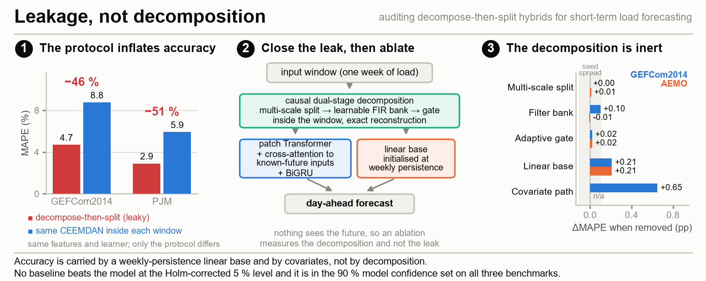

# Fuga, no descomposición: auditoría de los híbridos «descomponer y luego dividir» para la predicción de carga a corto plazo

[English](README.md) · **Español**

Código y resultados de una **auditoría** de la predicción de carga a corto plazo
(STLF) basada en descomposición de señales. Dos hallazgos: el protocolo
«descomponer y luego dividir» que domina esta literatura infla la precisión
publicada aproximadamente a la mitad, y, una vez cerrada esa fuga, la maquinaria
de descomposición no aporta nada medible. Publicado en **PyTorch y MATLAB**, con un
certificado de causalidad comprobado por máquina y un protocolo de cinco semillas
con contraste de significación. El manuscrito está en revisión en *Applied Energy*.

<p align="center">
  
</p>
<p align="center">
  
</p>

---

## Por qué existe este repositorio

La mayoría de los híbridos STLF basados en descomposición aplican CEEMDAN, EMD o VMD a la
**serie completa antes de la división entrenamiento–test**. Como son transformadas
*globales*, esto inyecta información futura en cada subsecuencia de entrenamiento e
infla la precisión publicada muy por encima de lo alcanzable en operación. Este
proyecto:

1. **Cuantifica ese sesgo.** Un contraste emparejado (el mismo CEEMDAN, la misma
   disposición de características, el mismo modelo, calculado globalmente o dentro de
   cada ventana) muestra que el protocolo «descomponer y luego dividir» publica un
   **46–51 % menos de error** que un protocolo causal, una ilusión creada únicamente por
   la evaluación (`python/leakage_demo.py`, `figures/Fig11_leakage_effect.png`).
2. **Lo sustituye por un análogo causal**, para que una ablación sea siquiera
   interpretable. La cadena offline CEEMDAN–entropía muestral–VMD se convierte en un
   análogo **dentro del modelo, aprendible de extremo a extremo y estrictamente causal**
   (división multiescala por medias móviles causales → banco de filtros FIR paso-banda
   causales aprendibles → puerta de complejidad diferenciable), tokenizado en parches de
   un día, codificado por un Transformer, fusionado con covariables futuras conocidas
   mediante atención cruzada, decodificado por una BiGRU con normalización de instancia
   reversible y anclado por una base lineal por componente más una vía de covariables a
   resolución completa.
3. **Evalúa con honestidad y publica sus propios resultados negativos.** Protocolo
   operativo a un día vista (ventanas sin solapamiento), estadísticos de preprocesado
   solo de entrenamiento, objetivos de test sin modificar, cinco semillas, tests de
   Diebold–Mariano con corrección de Holm, conjuntos de confianza de modelos, una
   comprobación de origen rodante y una ablación en dos benchmarks cuya respuesta es que
   la descomposición del punto 2 no aporta nada medible.

## Resultados principales (protocolo sin fugas, 5 semillas, MAPE %)

**1. Cuánta de la precisión publicada es la fuga.** Fijando la descomposición, las
características y el modelo, y variando únicamente si la transformada ve el futuro, el
protocolo inválido publica un **46,4 % menos de error en GEFCom2014 y un 50,9 % en PJM**
(46–56 % en MAPE, MAE y RMSE). Se reproduce con
`python leakage_demo.py --dataset GEFCom2014`.

**2. Qué aporta la descomposición una vez cerrada la fuga: nada medible.** Ablacionada en
un benchmark rico en covariables *y* en uno univariante, ni las etapas de descomposición
ni la puerta adaptativa mueven el MAPE a un día vista más que la dispersión entre cinco
semillas:

| Componente eliminado | GEFCom2014 | AEMO |
|---|---|---|
| Etapa 1 (división multiescala) | +0,00 pp | +0,01 pp |
| Etapa 2 (banco de filtros aprendible) | +0,10 pp | −0,01 pp |
| Puerta adaptativa | +0,02 pp | +0,01 pp |
| **Base lineal por componente** | **+0,21 pp** | **+0,21 pp** |
| Covariables futuras | +3,26 pp | −0,01 pp |

La base lineal, inicializada en la persistencia semanal, es el único componente con un
efecto resuelto en ambos benchmarks.

**3. El propio predictor**, como contexto. Quince modelos, protocolo operativo a un día
vista, cinco semillas:

| Dataset | **Propuesto** | Puesto | Mejor rival | Veredicto (DM con Holm) |
|---|---|---|---|---|
| **PJM** | **4,87** | **1 de 15** | PatchTST 4,98 | ninguno lo bate |
| **AEMO** | 5,53 | 2 de 15 | **TiDE 5,46** | ninguno lo bate; tampoco bate a TiDE |
| **GEFCom2014** | 4,73 | 11 de 15 | TCN 4,13 | ninguno lo bate |

Ensembles de cinco semillas comparados entre iguales (el de cada modelo, nunca uno frente
a ejecuciones individuales): 1.º de 13 en PJM (4,74), 2.º en AEMO (5,22 frente a 5,19 de
TiDE), 9.º de 13 en GEFCom2014 (4,27 frente a 3,70 de TCN).

**Ningún baseline supera al modelo propuesto al nivel del 5 % corregido por Holm en
ningún benchmark**; léase como paridad estadística con n = 259/902/274, no como igualdad
demostrada. El conjunto de confianza de modelos (Hansen–Lunde–Nason,
`python/model_confidence_set.py`, `results/mcs_v4.json`) dice lo mismo a nivel de
conjunto: el modelo propuesto está en el MCS del 90 % en todos los benchmarks y con ambas
pérdidas; en PJM, con pérdida absoluta, ese conjunto contiene solo al modelo propuesto,
PatchTST y TiDE. En una evaluación de origen rodante sobre tres periodos de test disjuntos
de PJM es primero en los tres por MAPE (media 4,10 frente a 4,33 de PatchTST), aunque
ningún test por periodo es significativo por sí solo y la dispersión *entre periodos*
(~0,7 pp) es varias veces la dispersión entre modelos.

> Una versión anterior de este repositorio afirmaba que la descomposición era
> determinante en carga univariante («la imagen especular del caso univariante»).
> Descansaba en un argumento de ranking, no en una ablación. La ablación univariante lo
> refuta y la afirmación se retira.

## Estructura del repositorio

```
.
├── python/        Implementación de referencia (PyTorch)
│   ├── main.py                 pipeline completo: entrenamiento, evaluación, tests DM, tablas, figuras
│   ├── model_proposed.py       el modelo CPTB propuesto + descomposición causal
│   ├── models_baselines.py     14 baselines, incl. DLinear, PatchTST, TiDE, naïve estacional
│   ├── data_utils.py           carga sin fugas, ventanas, máscara de datos observados
│   ├── prepare_data.py         descargas públicas → CSV canónicos, con recuento de filas comprobado
│   ├── train_pipeline.py       bucle de entrenamiento, corrección causal de errores, GBM/ARIMA
│   ├── metrics_stats.py        métricas + Diebold–Mariano (Newey-West, HLN, Holm)
│   ├── figures_tables.py       todas las tablas + el único driver de las 12 figuras
│   ├── figstyle.py             estilo de publicación compartido; paleta validada para daltonismo
│   ├── figures_diagrams.py     Figs. 1–2 (contraste de protocolos, arquitectura)
│   ├── figures_results.py      Figs. 3–12, todas calculadas desde los ficheros de resultados
│   ├── leakage_demo.py         el experimento controlado de fuga «descomponer y luego dividir»
│   ├── model_confidence_set.py MCS de Hansen–Lunde–Nason sobre las predicciones guardadas
│   ├── build_latex_tables.py   todas las tablas del manuscrito, impresas desde results/
│   ├── graphical_abstract.py   el graphical abstract, dibujado desde results/
│   ├── verify_cptb.py          certificado de causalidad / reconstrucción comprobado por máquina
│   └── scripts/                lanzadores de experimentos (origen rodante, selección solo con validación, reejecución de TiDE)
├── matlab/        Port independiente en MATLAB (Deep Learning Toolbox), verificado en paridad
├── results/       Tablas de resultados (CSV + LaTeX) y resúmenes JSON
├── figures/       Figuras de publicación (PDF + PNG a 300 dpi)
└── data/          Coloca aquí los datasets (ver data/README.md)
```

Regenerar todas las tablas y figuras desde los resultados guardados tarda segundos y no
necesita GPU:

```bash
cd python && python -c "import figures_tables as f; f.regenerate_from_saved()"
```

## Inicio rápido (Python)

```bash
cd python
pip install -r requirements.txt          # torch, numpy, pandas, scikit-learn, xgboost, lightgbm, statsmodels
python verify_cptb.py                     # certificado de causalidad comprobado por máquina (segundos)
python prepare_data.py --raw /ruta/a/descargas   # construye los CSV canónicos
python main.py                            # protocolo completo: 3 datasets, 5 semillas, ablación y figuras
python main.py --smoke                    # ejecución mínima de validación de extremo a extremo
python leakage_demo.py --dataset GEFCom2014   # reproduce la cuantificación de la fuga
```

## Inicio rápido (MATLAB)

```matlab
cd matlab
verify_cptb                 % certificado de corrección: formas, reconstrucción exacta,
                            % causalidad estricta, inicialización naïve, ablaciones, flujo de gradiente
results = main_v4('GEFCom2014');   % protocolo completo en un dataset
```

Requiere MATLAB R2022b o posterior y solo la Deep Learning Toolbox. Ver
[`matlab/README.md`](matlab/README.md).

## Figuras

Las doce las escribe un único driver desde los ficheros de resultados, con un estilo
compartido cuya paleta categórica está validada por máquina para deficiencias de visión
del color (ΔE en OKLab en cada par adyacente, más una comprobación de contraste).

| | | |
|---|---|---|
| **1** contraste de protocolos | **2** arquitectura | **3** descomposición causal de una ventana |
| **4** precisión en los benchmarks | **5–7** predicciones a un día vista, una por dataset | **8** ablación, dos benchmarks |
| **9** atención cruzada | **10** horizonte frente a hora del día | **11** el experimento de fuga |
| **12** estabilidad de origen rodante | | |

Dos de ellas juegan en contra de la propia tesis del artículo. La Figura 8 pone la misma
ablación en un benchmark rico en covariables y en uno univariante, lado a lado, y
encuentra ambas etapas de descomposición inertes en los dos. La Figura 10 muestra que el
error lo moldea tanto la hora del día como el horizonte, y que el calendario de emisión
diaria confunde ambos.

## Reproducibilidad y rigor

- **La causalidad se comprueba por máquina**, no se afirma: `verify_cptb` (en ambos
  lenguajes) perturba la entrada más reciente y confirma que ninguna salida anterior de la
  descomposición cambia, y comprueba la reconstrucción exacta y la inicialización naïve
  estacional.
- **Sin verdad fabricada**: los huecos de varias semanas de GEFCom2014 se detectan y toda
  ventana que solape datos fabricados se excluye del entrenamiento y de la evaluación.
- **Toda figura se genera desde ficheros de resultados**, y una entrada ausente lanza una
  excepción en lugar de sustituirse por un valor por defecto. Esto se impone, no solo se
  pretende: una auditoría de este repositorio encontró la Fig. 11 dibujada a partir de
  literales escritos en el código de la figura, porque `leakage_demo.py` imprimía su
  medida sin guardarla. Ahora escribe `results/leakage_GEFCom2014.json` y la figura lo lee.
- **Dos implementaciones independientes** (PyTorch y MATLAB) con paridad numérica
  verificada.

## Datasets

Los tres benchmarks son públicos; las instrucciones de descarga están en
[`data/README.md`](data/README.md). GEFCom2014 (horario, con temperatura), PJM
Interconnection East (horario) y AEMO Nueva Gales del Sur (semihorario).

## Cita

```bibtex
@article{Valdivieso2026leakage,
  author  = {Valdivieso, V{\'i}ctor and L{\'o}pez-Lao, Emilio and Garc{\'i}a-Chica, Antonio
             and Cama-Pinto, Alejandro and Arrabal-Campos, Francisco M.},
  title   = {Leakage, not decomposition: auditing decompose-then-split hybrids
             for short-term load forecasting},
  journal = {Applied Energy},
  note    = {Under review},
  year    = {2026}
}
```

Autor de correspondencia: Francisco M. Arrabal-Campos (fmarrabal@ual.es).

## Licencia

Publicado bajo la [licencia MIT](LICENSE).
