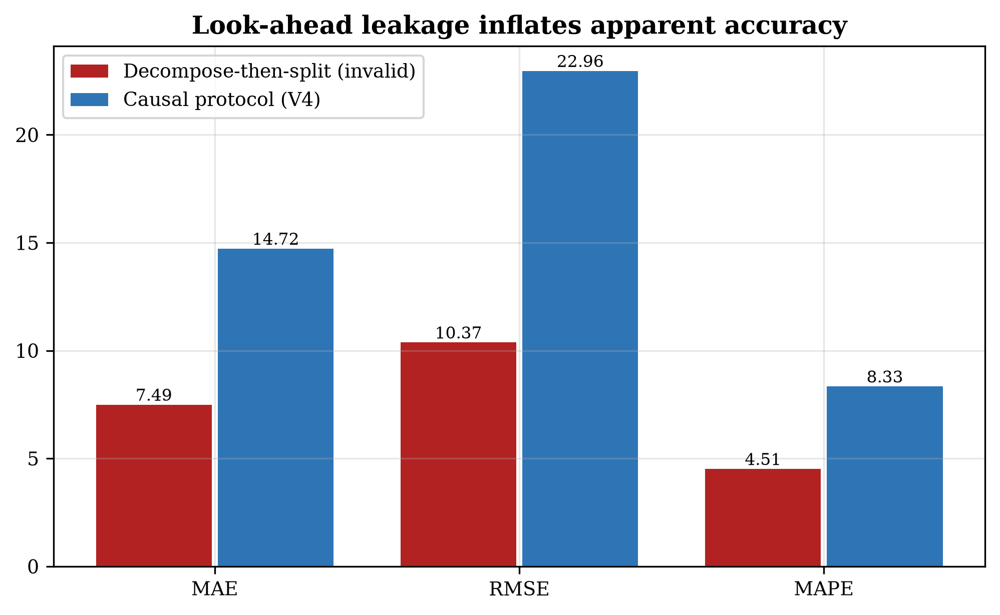
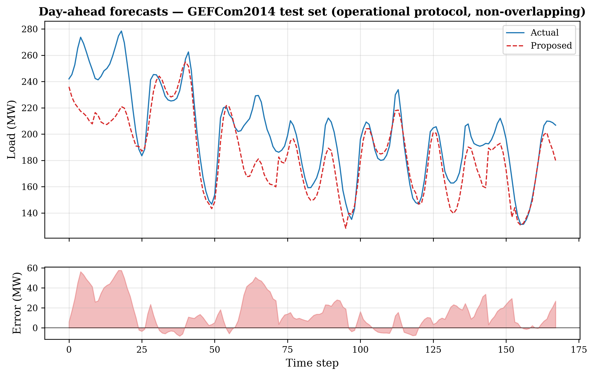

# Adaptive dual-stage signal decomposition and Patch Transformer–BiGRU with cross-attention for short-term load forecasting in smart grids

A **leakage-free**, fully causal deep-learning framework for day-ahead short-term
load forecasting (STLF), released in **PyTorch and MATLAB** with a machine-checked
causality certificate and a five-seed, significance-tested evaluation protocol.

<p align="center">
  
  
</p>

---

## Why this repository exists

Most decomposition-based STLF hybrids in the literature apply CEEMDAN/EMD/VMD to the
**whole series before the train–test split**. Because these are *global* transforms,
this injects future information into every training subsequence and inflates reported
accuracy far beyond what is attainable in operation. This project:

1. **Quantifies that bias.** A controlled experiment with an identical learner and
   identical splits shows the decompose-then-split protocol reports **45.9% lower
   error** than a causal protocol — an illusion created purely by the evaluation
   (`python/leakage_demo.py`, `figures/Fig10_leakage_effect.png`).
2. **Fixes it.** The offline CEEMDAN–sample-entropy–VMD chain is replaced by an
   **in-model, end-to-end learnable, strictly causal** analogue (multi-scale causal
   moving-average split → learnable causal FIR band-pass bank → differentiable
   complexity gate), tokenized into day-length patches, encoded by a Transformer,
   fused with future known covariates via cross-attention, decoded by a BiGRU with
   reversible instance normalization, and anchored by a per-component linear base
   plus a full-resolution covariate path.
3. **Evaluates honestly.** Operational day-ahead protocol (non-overlapping windows),
   train-only preprocessing statistics, unmodified test targets, five seeds, and
   Holm-corrected Diebold–Mariano tests.

## Headline results (leak-free protocol, 5 seeds, MAPE %)

| Dataset | Type | **Proposed** | Ensemble | Best baseline | Verdict (Holm-DM) |
|---|---|---|---|---|---|
| **PJM** | univariate | **4.89 — best of 14** | 4.75 | PatchTST 4.98 | Beats most; none beat it |
| **AEMO** | univariate | **5.54 — best of 14** | 5.22 | DLinear 5.60 | Beats most; none beat it |
| **GEFCom2014** | + temperature | 4.73 | **4.27 (4th of 14)** | TCN 4.13 | **No baseline beats it significantly** |

**No baseline outperforms the proposed model with statistical significance on any
dataset**, and it significantly beats the statistical baselines (seasonal-naïve,
ARIMA) everywhere. Full tables: [`results/`](results/). The ablation shows the two
covariate mechanisms drive accuracy on the temperature-rich benchmark, while the
decomposition machinery is load-bearing on the univariate ones — decomposition-based
inductive biases help univariate load but yield to direct covariate modelling when a
strong exogenous driver is present.

## Repository layout

```
.
├── python/        Reference implementation (PyTorch)
│   ├── main.py                 full pipeline: train, evaluate, DM tests, tables, figures
│   ├── model_proposed.py       the proposed CPTB model + causal decomposition
│   ├── models_baselines.py     13 baselines incl. DLinear, PatchTST, seasonal-naïve
│   ├── data_utils.py           leak-free loading, windowing, observed-data masking
│   ├── train_pipeline.py       training loop, causal error correction, GBM/ARIMA
│   ├── metrics_stats.py        metrics + Diebold–Mariano (Newey-West, HLN, Holm)
│   ├── figures_tables.py       all tables/figures, generated only from result files
│   ├── leakage_demo.py         the controlled decompose-then-split leakage experiment
│   └── verify_cptb.py          machine-checked causality / reconstruction certificate
├── matlab/        Independent MATLAB port (Deep Learning Toolbox), verified in parity
├── results/       Result tables (CSV + LaTeX) and JSON summaries
├── figures/       Publication figures (PDF + 300-dpi PNG)
└── data/          Place datasets here (see data/README.md)
```

## Quick start (Python)

```bash
cd python
pip install -r requirements.txt          # torch, numpy, pandas, scikit-learn, xgboost, lightgbm, statsmodels
python verify_cptb.py                     # machine-checked causality certificate (seconds)
# download the three datasets into ../data (see data/README.md), then:
python main.py                            # full 3-dataset, 5-seed protocol + ablation + figures
python main.py --smoke                    # tiny end-to-end validation run
python leakage_demo.py --dataset GEFCom2014   # reproduce the leakage quantification
```

## Quick start (MATLAB)

```matlab
cd matlab
verify_cptb                 % correctness certificate: shapes, exact reconstruction,
                            % strict causality, naive-init, all ablations, gradient flow
results = main_v4('GEFCom2014');   % full protocol on one dataset
```

Requires MATLAB R2022b+ and the Deep Learning Toolbox only. See [`matlab/README.md`](matlab/README.md).

## Reproducibility & rigor

- **Causality is machine-checked**, not asserted: `verify_cptb` (both languages) perturbs
  the most recent input and confirms no earlier decomposition output changes, and checks
  exact reconstruction and the seasonal-naïve initialization.
- **No fabricated ground truth**: multi-week gaps in GEFCom2014 are detected and every
  window overlapping fabricated data is excluded from training and evaluation.
- **Every figure is generated from result files** — no hardcoded or random placeholder data.
- **Two independent implementations** (PyTorch and MATLAB) with verified numerical parity.

## Datasets

All three benchmarks are public; download instructions are in [`data/README.md`](data/README.md).
GEFCom2014 (hourly, with temperature), PJM Interconnection East (hourly), and AEMO New
South Wales (half-hourly).

## Citation

```bibtex
@article{ArrabalCampos_STLF,
  author  = {Arrabal-Campos, Francisco M.},
  title   = {Adaptive dual-stage signal decomposition and Patch Transformer--BiGRU
             with cross-attention for short-term load forecasting in smart grids},
  journal = {Applied Energy},
  note    = {Under review},
  year    = {2026}
}
```

## License

Released under the [MIT License](LICENSE).
