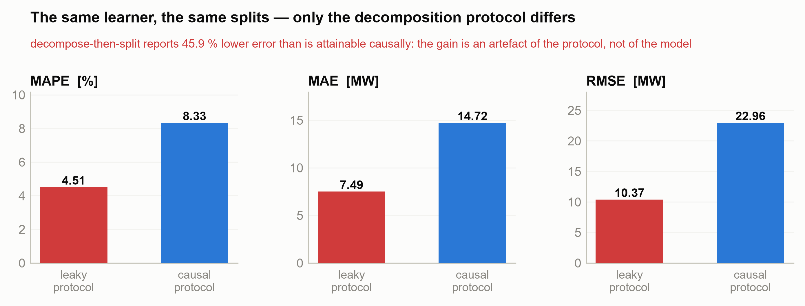
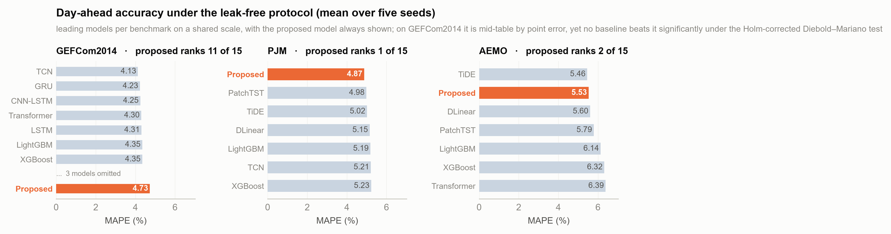

# Leakage, not decomposition: auditing decompose-then-split hybrids for short-term load forecasting

Code and results for an **audit** of decomposition-based short-term load
forecasting (STLF). Two findings: the decompose-then-split protocol that dominates
this literature inflates reported accuracy by roughly half, and once that leak is
closed the decomposition machinery does no measurable work. Released in **PyTorch
and MATLAB** with a machine-checked causality certificate and a five-seed,
significance-tested protocol.

<p align="center">
  
</p>
<p align="center">
  
</p>

---

## Why this repository exists

Most decomposition-based STLF hybrids in the literature apply CEEMDAN/EMD/VMD to the
**whole series before the train–test split**. Because these are *global* transforms,
this injects future information into every training subsequence and inflates reported
accuracy far beyond what is attainable in operation. This project:

1. **Quantifies that bias.** A matched contrast — the same CEEMDAN, the same
   feature layout, the same learner, computed globally or inside each window —
   shows the decompose-then-split protocol reports **46–51 % lower error** than a
   causal protocol, an illusion created purely by the evaluation
   (`python/leakage_demo.py`, `figures/Fig11_leakage_effect.png`).
2. **Replaces it with a causal analogue**, so that an ablation becomes
   interpretable at all. The offline CEEMDAN–sample-entropy–VMD chain becomes an
   **in-model, end-to-end learnable, strictly causal** analogue (multi-scale causal
   moving-average split → learnable causal FIR band-pass bank → differentiable
   complexity gate), tokenized into day-length patches, encoded by a Transformer,
   fused with future known covariates via cross-attention, decoded by a BiGRU with
   reversible instance normalization, and anchored by a per-component linear base
   plus a full-resolution covariate path.
3. **Evaluates honestly, and reports against itself.** Operational day-ahead
   protocol (non-overlapping windows), train-only preprocessing statistics,
   unmodified test targets, five seeds, Holm-corrected Diebold–Mariano tests, a
   rolling-origin check, and an ablation on two benchmarks whose answer is that
   the decomposition in point 2 contributes nothing measurable.

## Headline results (leak-free protocol, 5 seeds, MAPE %)

**1. How much of the reported accuracy is the leak.** Holding the decomposition,
the features and the learner fixed and varying only whether the transform sees
the future, the invalid protocol reports **46.4 % lower error on GEFCom2014 and
50.9 % on PJM** (46–56 % across MAPE, MAE and RMSE). Reproduce with
`python leakage_demo.py --dataset GEFCom2014`.

**2. What the decomposition contributes once the leak is closed: nothing
measurable.** Ablated on a covariate-rich benchmark *and* on a univariate one,
neither decomposition stage nor the adaptive gate moves day-ahead MAPE by more
than the spread across five seeds:

| Component removed | GEFCom2014 | AEMO |
|---|---|---|
| Stage 1 (multi-scale split) | +0.00 pp | +0.01 pp |
| Stage 2 (learnable filter bank) | +0.10 pp | −0.01 pp |
| Adaptive gate | +0.02 pp | +0.01 pp |
| **Per-component linear base** | **+0.21 pp** | **+0.21 pp** |
| Future covariates | +3.26 pp | −0.01 pp |

The linear base — initialised at weekly persistence — is the only component with
a resolved effect on both benchmarks.

**3. The forecaster itself**, for context. Fifteen models, operational day-ahead
protocol, five seeds:

| Dataset | **Proposed** | Rank | Best other | Verdict (Holm-DM) |
|---|---|---|---|---|
| **PJM** | **4.87** | **1 of 15** | PatchTST 4.98 | none beat it |
| **AEMO** | 5.53 | 2 of 15 | **TiDE 5.46** | none beat it; it does not beat TiDE |
| **GEFCom2014** | 4.73 | 11 of 15 | TCN 4.13 | none beat it |

Like-for-like five-seed ensembles (every model's, never one against single runs):
1st of 13 on PJM (4.74), 2nd on AEMO (5.22 vs TiDE 5.19), 9th of 13 on
GEFCom2014 (4.27 vs 3.70 for TCN).

**No baseline outperforms the proposed model at the Holm-corrected 5 % level on
any benchmark** — read as statistical parity at n = 259/902/274, not as
demonstrated equality. The model confidence set (Hansen–Lunde–Nason, 
`python/model_confidence_set.py`, `results/mcs_v4.json`) says the same thing
set-wise: the proposed model is in the 90 % MCS on every benchmark under both
losses; on PJM under absolute loss that set contains only the proposed model,
PatchTST and TiDE. On a rolling-origin evaluation over three disjoint PJM test
periods it is first on all three by MAPE (mean 4.10 vs 4.33 for PatchTST),
though no per-period test is individually significant and the spread *between
periods* (~0.7 pp) is several times the spread between models.

> An earlier version of this repository claimed the decomposition was
> load-bearing on univariate load — "the mirror image of the univariate case".
> That rested on a ranking argument, not an ablation. The univariate ablation
> refutes it, and the claim is withdrawn.

## Repository layout

```
.
├── python/        Reference implementation (PyTorch)
│   ├── main.py                 full pipeline: train, evaluate, DM tests, tables, figures
│   ├── model_proposed.py       the proposed CPTB model + causal decomposition
│   ├── models_baselines.py     14 baselines incl. DLinear, PatchTST, TiDE, seasonal-naïve
│   ├── data_utils.py           leak-free loading, windowing, observed-data masking
│   ├── prepare_data.py         raw public downloads → the canonical CSVs, row-count checked
│   ├── train_pipeline.py       training loop, causal error correction, GBM/ARIMA
│   ├── metrics_stats.py        metrics + Diebold–Mariano (Newey-West, HLN, Holm)
│   ├── figures_tables.py       every table + the single driver for all 12 figures
│   ├── figstyle.py             shared publication style; palette validated for CVD
│   ├── figures_diagrams.py     Figs 1–2 (protocol contrast, architecture)
│   ├── figures_results.py      Figs 3–12, all computed from saved result files
│   ├── leakage_demo.py         the controlled decompose-then-split leakage experiment
│   ├── model_confidence_set.py Hansen–Lunde–Nason MCS over the saved forecasts
│   ├── build_latex_tables.py   every table of the manuscript, printed from results/
│   └── verify_cptb.py          machine-checked causality / reconstruction certificate
├── matlab/        Independent MATLAB port (Deep Learning Toolbox), verified in parity
├── results/       Result tables (CSV + LaTeX) and JSON summaries
├── figures/       Publication figures (PDF + 300-dpi PNG)
└── data/          Place datasets here (see data/README.md)
```

Regenerating every table and figure from the saved results takes seconds and needs
no GPU:

```bash
cd python && python -c "import figures_tables as f; f.regenerate_from_saved()"
```

## Quick start (Python)

```bash
cd python
pip install -r requirements.txt          # torch, numpy, pandas, scikit-learn, xgboost, lightgbm, statsmodels
python verify_cptb.py                     # machine-checked causality certificate (seconds)
python prepare_data.py --raw /path/to/raw_downloads   # build the canonical CSVs
python main.py                            # full 3-dataset, 5-seed protocol + ablation + figures
python main.py --smoke                    # tiny end-to-end validation run
python leakage_demo.py --dataset GEFCom2014   # reproduce the leakage quantification
```

## Quick start (MATLAB)

```matlab
cd matlab
verify_cptb                 % correctness certificate: shapes, exact reconstruction,
                            % strict causality, naive-init, all ablations, gradient flow
results = main_v4('GEFCom2014');   % full protocol on one dataset
```

Requires MATLAB R2022b+ and the Deep Learning Toolbox only. See [`matlab/README.md`](matlab/README.md).

## Figures

All twelve are written by one driver from the saved result files, in a shared
style whose categorical palette is machine-validated for colour-vision
deficiency (OKLab ΔE on every adjacent pair, plus a contrast check).

| | | |
|---|---|---|
| **1** protocol contrast | **2** architecture | **3** causal decomposition of one window |
| **4** accuracy across benchmarks | **5–7** day-ahead forecasts, one per dataset | **8** ablation, two benchmarks |
| **9** cross-attention | **10** lead time vs time of day | **11** the leakage experiment |
| **12** rolling-origin stability | | |

Two of them report against the paper's own thesis. Figure 8 puts the same
ablation on a covariate-rich and a univariate benchmark side by side, and finds
both decomposition stages inert on each. Figure 10 shows the error is shaped as
much by time of day as by lead time, and that the once-a-day issue schedule
confounds the two.

## Reproducibility & rigor

- **Causality is machine-checked**, not asserted: `verify_cptb` (both languages) perturbs
  the most recent input and confirms no earlier decomposition output changes, and checks
  exact reconstruction and the seasonal-naïve initialization.
- **No fabricated ground truth**: multi-week gaps in GEFCom2014 are detected and every
  window overlapping fabricated data is excluded from training and evaluation.
- **Every figure is generated from result files**, and a missing input raises rather than
  falling back to a default. This is enforced, not merely intended: an audit of this
  repository found Fig. 11 being drawn from literals typed into the figure code, because
  `leakage_demo.py` printed its measurement without saving it. It now writes
  `results/leakage_GEFCom2014.json`, and the figure reads it back.
- **Two independent implementations** (PyTorch and MATLAB) with verified numerical parity.

## Datasets

All three benchmarks are public; download instructions are in [`data/README.md`](data/README.md).
GEFCom2014 (hourly, with temperature), PJM Interconnection East (hourly), and AEMO New
South Wales (half-hourly).

## Citation

```bibtex
@article{ArrabalCampos_STLF,
  author  = {Arrabal-Campos, Francisco M.},
  title   = {Adaptive dual-stage signal decomposition and Patch Transformer--BiGRU
             with cross-attention for short-term load forecasting in smart grids},
  journal = {Applied Energy},
  note    = {Under review},
  year    = {2026}
}
```

## License

Released under the [MIT License](LICENSE).
